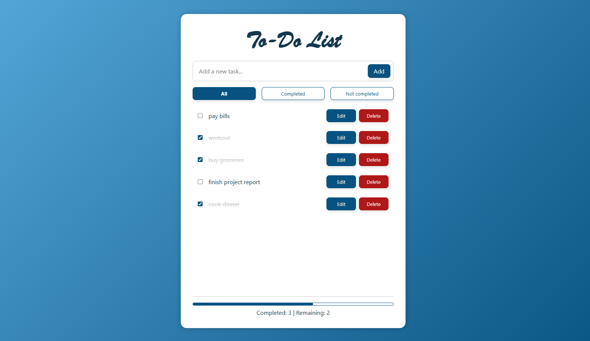

# To-Do List App 📝

A full-stack To-Do List application built with the **PERN stack** (*PostgreSQL, Express, React, Node.js*). Users can add, edit, delete, and mark todos as completed. Includes filters and real-time todo statistics.

## ✨ Features
- Add, edit, delete todos
- Mark todos as completed/uncompleted
- Filter todos by status (all, completed, uncompleted)
- View todo statistics (completed/uncompleted count)
- Smooth scroll when todos overflow

## 🖼️ Screenshots



## 🛠️ Technologies Used
- **Front-End:** React, Redux, CSS
- **Back-End:** Node.js, Express
- **Database:** PostgreSQL

## 🔗 API Endpoints

- `GET /api/todos` - Get all todos
- `POST /api/todos` - Create new todo
- `PUT /api/todos/:id` - Update todo
- `PATCH /api/todos/:id` - Toggle todo (mark todo as completed/uncompleted)
- `DELETE /api/todos/:id` - Delete a todo

## 🚀 How to Run
### 1️⃣ Clone the Repository
```
git clone https://github.com/lia-xyz/pern-todo-app.git
```
### 2️⃣ Backend Setup:
1. Install dependencies: 
```
cd server
npm install
```
2. Create a `.env` file:
```
PORT=your_port
DB_HOST=your_db_host
DB_PORT=your_db_port
DB_USER=your_db_username
DB_PASSWORD=your_db_password
DB_DATABASE=your_db
```
3. Create PostgreSQL database and table:
```
CREATE DATABASE todo_db;

CREATE TABLE todos (
    id SERIAL PRIMARY KEY,
    title VARCHAR(255) NOT NULL,
    is_completed BOOLEAN DEFAULT false
);
```
4. Run the server: `npm start`

### 3️⃣ Frontend Setup:
1. Install dependencies: 
```
cd ../client
npm install
```
2. Create a `.env` file:
```
REACT_APP_API_URL=your_api_url
```
3. Start the React app: `npm start`

## 🌱 Future Improvements
- User authentication (login/register)
- Dark/light theme toggle
- Drag & drop reorder
- Search bar
- Due dates and reminders

## 🤝 Contributing
Contributions, issues, and feature requests are welcome!  
Feel free to fork the repo and submit a pull request.

## 📄 License
This project is licensed under the MIT License. See the [LICENSE](LICENSE) file for details.